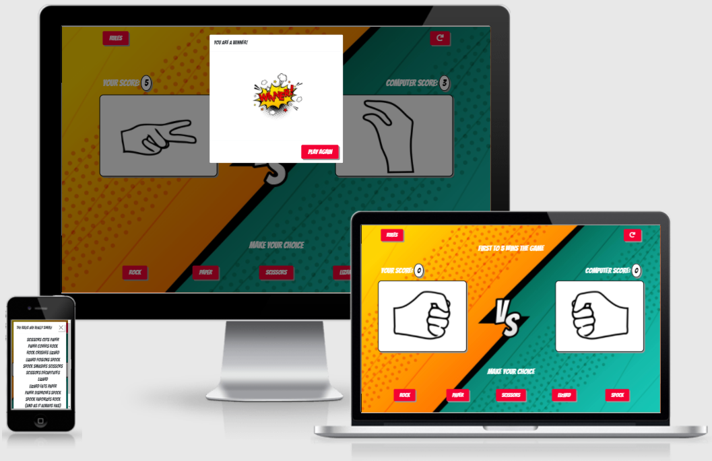
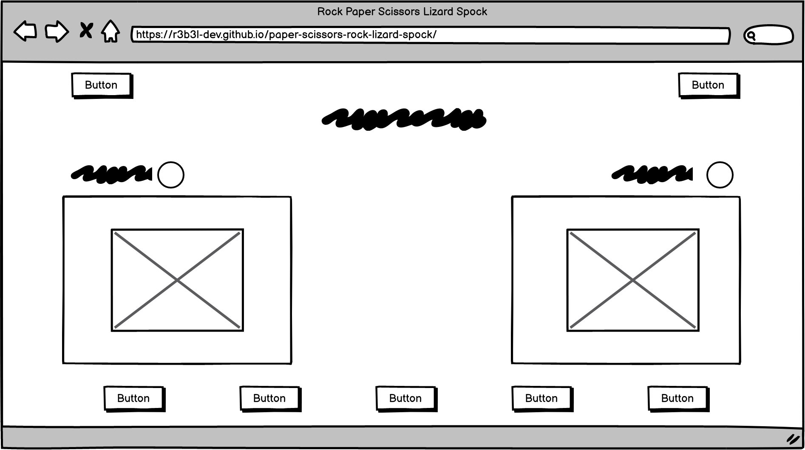

# Rock Paper Scissors Lizard Spock Game

[You can view the live site here](https://r3b3l-dev.github.io/paper-scissors-rock-lizard-spock/)

## Project Overview

Rock Paper Scissors Lizard Spock is an extension of the classic game of chance, Rock Paper Scissors, created by Sam Kass and Karen Bryla. Sam Kass explains he created the expanded game because it seemed like most games of Rock Paper Scissors with people you know would end in a tie.

[View further details here](https://the-big-bang-theory.com/rock-paper-scissors-lizard-spock/)

## Project Goals

The goal of this project was to make a simple game that would help players learn the rules of the additional lizard spock components in a fun and playful way.

## User Experience

### User Goals

The user goals of this website are:
- To **learn** how to play Rock Paper Scissors Lizard Spock.
- To **practice** their skills and understand the additional choices and combinations that lizard and Spock bring to the traditional game.
- To have **fun** whilst learning something new.

### Target Audience

This game is targeted towards both children and adults. The simple clean interface appeals to all ages.

## User Stories

1. As a new user I want to play Rock Paper Scissors Lizard Spock.
2. As a new user I want to understand the rules of the game.
3. As a new user I want to be able to tell if I am winning or losing against the computer.
4. As a new user I want to be able to tell what option the computer chose against me.
5. As a new user I want to be able to reset the overall game at any point to start again.
6. As a new user I want to be able to see if I have won or lost the overall game against the computer.

## Wireframe

[You can view the wire frame here](docs/wireframes/wireframe.png)

## Surface

### Color Scheme

The colour scheme takes inspiration from traditional marvel comic book covers and is meant to evoke feelings of fun and playfulness.

### Font

Bangers is a comic book style font which packs a punch! It is designed in the style of mid-20th century superhero comics cover lettering. The font was chosen to add a playful and fun feel to the game.

## Game Features

### Reset and Rules

The rules button in the top left corner of the screen allows the user to quickly access the rules of the game. 
If there is a need to reset the game at any point before either player reaches a score of 5 this can be done in the top right of the screen via the reset button.

### Player Score Area and Winner Announcement

The player score is prominent clear and easy for the user to understand if they are winning or losing in the game. The "First to 5 Wins the Game" message explains how the game is won and is replaced with a win, draw or lose message including a message explaining which choice won.

### The Player Choice Display Section

This section visually displays the user choice image and the computer choice image based on their selection.

### The Game Option Buttons

The game options are displayed at the bottom of the screen and allow the user to select an option. This kicks off the game functionality.

## Modals

### Rules Modal

This modal displays the rules of the game and is available to click at any time during an ongoing game.

### Winner Modal

The winner modal is displayed when the user is the first to score 5 points. The play again button refreshes the game and resets the scores to 0. 
**The modal can only close by hitting the play again button.**

### Loser Modal

The loser modal is displayed when the computer is the first to score 5 points. The play again button refreshes the game and resets the scores to 0. 
**The modal can only close by hitting the play again button.**

## Testing 

[You can view the testing file here](TESTING.md)

## Deployment

The project was deployed to GitHub pages using the following steps:
  
  1. Once logged in to **GitHub**, navigate to the site's [repository](https://github.com/r3b3l-dev/paper-scissors-rock-lizard-spock).
  2. Under repository name , click **Settings**.
  3. In the left sidebar, click **Pages** on the left-hand menu.
  4. Under "Source", select the **Main Branch** and hit **Save**.
  5. To see your published site, under **GitHub Pages**, click the site's URL.

### Local Deployment

In order to make a local copy of this application, you can clone it by typing the following command in your IDE Terminal:

- `git clone https://github.com/r3b3l-dev/paper-scissors-rock-lizard-spock.git`

Alternatively, if using Gitpod, you can [click here](https://gitpod.io/#https://github.com/r3b3l-dev/paper-scissors-rock-lizard-spock) to start a new Gitpod workspace on your account.

## Technologies Used

### Frameworks and Languages

[HTML5](https://en.wikipedia.org/wiki/HTML5) - Used for the main context of the site and layout.

[CSS3](https://en.wikipedia.org/wiki/CSS3) - Used for the styles of the site.

[JavaScript](https://en.wikipedia.org/wiki/JavaScript) - Used for the main interaction with the DOM.

[Bootstrap v5.0.2](https://getbootstrap.com/) - Used for better responsiveness and layout.

### Code Repository, Writing, and Version Control

[Gitpod](https://gitpod.io) - Used for development as the cloud-based IDE.

[GitHub](https://github.com/) - Used for securing my code online.

[Git](https://git-scm.com/) - Used for version control (`git add`, `git commit`, `git push`)

### Issue Tracker

[GitHub Issues](https://github.com/features/issues/) - Used to track any issues internally to my repository.

### Software

[Favicon](https://favicon.io/) - Used to generate the favicon.

[Balsamiq](https://balsamiq.com/) - Used to create my wireframes.

[ResizeImage.net](https://resizeimage.net/) - Used to resize my images online.

[Google Fonts](https://fonts.google.com/) - Used for typography on the site.

[Font Awesome](https://fontawesome.com/) - Used for icons on the site.

[Am I Responsive](http://ami.responsivedesign.is/) - Used to generate the responsive image at the top of the README.

[Site Palette](https://palette.site/) - Used to generate the README site palette.

## Credits

### Game Images

- Main Background Image from [Shutterstock](https://www.shutterstock.com/image-vector/comic-competition-speech-bubbles-set-expression-618357410)

- Player Selection Icons from [PNGEGG](https://unsplash.com/@icons8?utm_source=unsplash&utm_medium=referral&utm_content=creditCopyText)

- Computer Selection Icons from [PNGEGG](https://unsplash.com/@icons8?utm_source=unsplash&utm_medium=referral&utm_content=creditCopyText)

## Acknowledgments & References

- CSS Framework and Modals [Bootstrap](https://getbootstrap.com/docs/5.0/getting-started/introduction/)

- CSS & HTML [W3Schools](https://www.w3schools.com/)

- External references for specific code is included in comments. These are from [StackOverflow](https://stackoverflow.com/) 

#### Disclaimer

The content of this website is for educational purposes only and not intended for commercial use.
