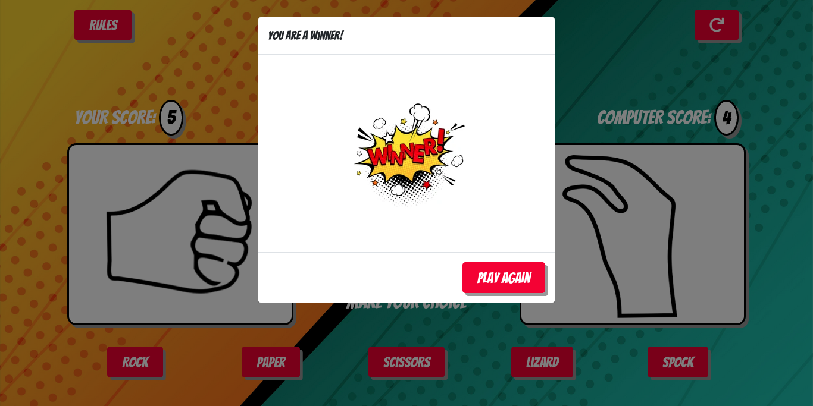
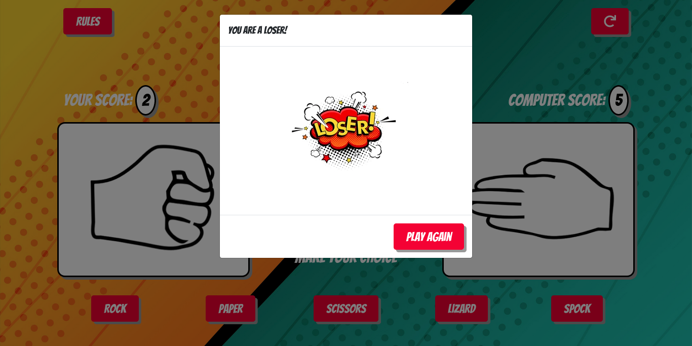
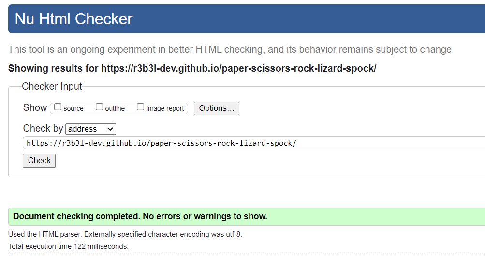

# Rock Paper Scissors Lizard Spock Game - Testing

[You can view the main README.md file here](README.md)

## User Story Testing

1. As a new user I want to play Rock Paper Scissors Lizard Spock.

- 

2. As a new user I want to understand the rules of the game.

- 
- 

3. As a new user I want to be able to tell if I am winning or losing against the computer.

- 
- 
- 
- 

4. As a new user I want to be able to tell what option the computer chose against me.

- 

5. As a new user I want to be able to reset the overall game at any point to start again.

- 

6. As a new user I want to be able to see if I have won or lost the overall game against the computer.

- 
- 

## Browser Testing

### Firefox

- Website was tested in Firefox developer edition browser

### Brave / Chromium

- Website was tested in Brave / Chromium browser 

## Code Validation

### JSHint Static Code Analysis

JSHint - [JSHint Static Code Analysis](https://jshint.com/) 

### CSS Markup Validation 

CSS - [W3C Markup Validation Service](https://validator.w3.org/) 

- Congratulations! No Error Found.

### HTML Markup Validation
HTML - [W3C Markup Validation Service](https://validator.w3.org/) 

- Document checking completed. No errors or warnings to show.

## Accessibility / SEO / Performance

### Google Lighthouse
Google lighthouse was used to test for accessibility / seo / performance.

### GTmetrix

GTmetrix was used for web page performance testing

## GitHub Issue Tracker

GitHub issues was used to track bugs, todo items, and any remaining issues for the project.

### Remaining Issues (`is:issue is:open`)

- **Complete User Story Testing** - [#4](https://github.com/r3b3l-dev/paper-scissors-rock-lizard-spock/issues/4)
- **Javascript JSHint feedback - One Undefined Variable** - [#3](https://github.com/r3b3l-dev/paper-scissors-rock-lizard-spock/issues/3)
- **Javascript if else statement for game logic needs DRY approach** - [#2](https://github.com/r3b3l-dev/paper-scissors-rock-lizard-spock/issues/2)
- **Mobile responsive layout for main page** - [#1](https://github.com/r3b3l-dev/paper-scissors-rock-lizard-spock/issues/1)

I plan to come back to this project and improve on these areas in the future.